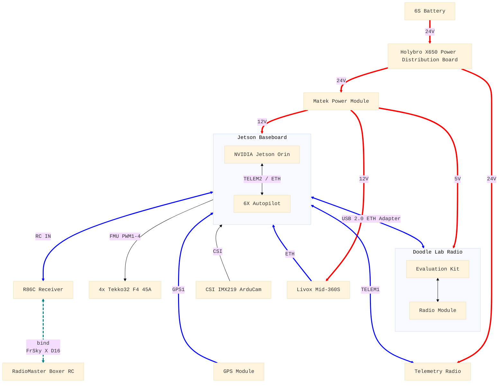

# Bill of Materials

> The following is an example of the hardware components necessary to build a quadcopter supporting **ALL** of `aerial-autonomy-stack`'s capabilities, including perception and multi-robot communication/swarming for about 6,000 USD


## Example AAS Quadcopter

| #   | Part                                  | Description                                            | Cost (USD) | Link         |
| --: | ------------------------------------- | ------------------------------------------------------ | ---------: | ------------ |
| 1   | Holybro X650 Almost-ready-to-fly Kit  | Quadcopter frame, motors, ESCs, propellers             | 699        | [URL][kit]
| 2   | Holybro H-RTK ZED-F9P Ultralight      | GNSS module (GPS, GLONASS, Galileo, BeiDou)            | 279        | [URL][gps]
| 3   | Holybro Fixed Carbon Fiber GPS mount  | GNSS module support                                    | 12         | [URL][mount]
| 4   | Holybro Microhard Telemetry Radio*    | Point-to-multipoint telemetry (1 ground + 1 per drone) | 449        | [URL][telem]
| 5   | RadioMaster Boxer RC CC2500           | Radio controller                                       | 100        | [URL][rc]
| 6   | RadioMaster R86C V2 Receiver          | Receiver for the radio controller                      | 28         | [URL][rec]
| 7   | Matek Power Module PM12S-4A           | 5V and 12V supply for Doodle and Jetson                | 20         | [URL][matek]
| 8   | Tattu G-Tech 6S 8000mAh 25C 22.2V     | Lipo battery pack with XT60                            | 162        | [URL][batt]
| 9   | Pixhawk Jetson Baseboard Bundle       | NVIDIA Orin NX 16GB + SSD + Pixhawk 6X + CSI ArduCam   | 1450       | [URL][jetson]
| 10  | ASIX AX88772A USB2.0 Ethernet Adapter | 1 for `AIR_SUBNET`, 1 for `SIM_SUBNET` (for HITL only) | 18         | [URL][eth]
| 11  | Doodle Labs RM-2450-11N3              | 2.4GHz Nano radio module (1 ground + 1 per drone)      | 1700       | [URL][doot1]
| 12  | Doodle Labs EK-2450-11N3              | Nano carrier/evaluation kit (1 ground + 1 per drone)   | 290        | [URL][doot2]
| 13  | DJI Livox Mid-360S**                  | LiDAR sensor                                           | 679        | [URL][liv]
| 14  | Livox three-wire aviation connector** | Power and ethernet connector for the LiDAR             | 89         | [URL][liv2]

> *For a single drone, one can alternatively use the point-to-point [SiK telemetry radio][telem2] (89)
>
> **LiDAR sensor, optional for a camera-only solution



[kit]:https://holybro.com/collections/x650-kits/products/x650-kits?variant=43994378240189
[gps]:https://holybro.com/collections/standard-h-rtk-series/products/h-rtk-f9p-ultralight?variant=45785783009469
[mount]:https://holybro.com/collections/gps-accessories/products/fixed-carbon-fiber-gps-mount?variant=42749655449789
[telem]:https://holybro.com/collections/telemetry-radios/products/microhard-radio?variant=42522025590973
[telem2]:https://holybro.com/collections/telemetry-radios/products/sik-telemetry-radio-1w?variant=45094904856765
[rc]:https://radiomasterrc.com/collections/boxer-radio/products/boxer-radio-controller-m2?variant=46486352298176
[rec]:https://holybro.com/products/radiomaster-r86c-receiver
[matek]:https://www.mateksys.com/?portfolio=pm12s-4a
[batt]:https://genstattu.com/tattu-8000mah-22-2v-25c-6s1p-lipo-battery-pack-with-xt60-plug.html
[jetson]:https://holybro.com/collections/flight-controllers/products/pixhawk-jetson-baseboard?variant=44636223439037
[eth]:https://www.amazon.ca/TRENDnet-TU2-ET100-USB-Mbps-Adapter/dp/B00007IFED/
[liv]:https://store.dji.com/ca/product/livox-mid-360s?vid=219111
[liv2]:https://store.dji.com/ca/product/livox-three-wire-aviation-connector?vid=117441
[doot1]:https://www.mouser.ca/ProductDetail/Doodle-Labs/RM-2450-11N3?qs=ulEaXIWI0c91eCn7VRB%2FpA%3D%3D
[doot2]:https://www.mouser.ca/ProductDetail/Doodle-Labs/EK-2450-11N3?qs=ulEaXIWI0c%2FLOqPeL4gNgg%3D%3D

## Holybro X650 with 6X Autopilot Parameters

Non-default parameters for the Holybro X650 kit; for full `.params` files examples, check folder [`params/`](/tools_and_docs/docs/params/)

<!--
### PX4 Configuration

```sh
TBD
```
-->

### ArduPilot Configuration

```sh
# GPS module
GPS1_TYPE           1               # Auto, here GPS1 refers to the primary GPS, not the 6X port; if connecting to the GPS2 port (SERIAL4) remember to set SERIAL3_PROTOCOL (GPS1 port) to -1/None

# DShot ESCs (Tekko32 F4 45A)
SERVOx_FUNCTION     0               # Disabled, for SERVO1 to 4, these are channels 1 to 4 on IO PWM
MOT_PWM_TYPE        6               # DShot600, for the Tekko32 F4 45A ESCs, using the first 4 channels on FMU PWM, i.e. SERVO9 to 12
SERVO9_FUNCTION     33              # Motor 1, channel 1 on FMU PWM
SERVO10_FUNCTION    34              # Motor 2, channel 2 on FMU PWM
SERVO11_FUNCTION    35              # Motor 3, channel 3 on FMU PWM
SERVO12_FUNCTION    36              # Motor 4, channel 4 on FMU PWM
SERVOx_MIN          1000            # For SERVO9 to 12
SERVOx_MAX          2000            # For SERVO9 to 12
SERVOx_TRIM         1000            # For SERVO9 to 12
# If needed to configure the ESCs, remove the propellers and set BRD_SAFETY_DEFLT to 0 (Disabled) or make sure BRD_SAFETY_MASK ignores channels 9 to 12
# In QGC -> Vehicle Configuration -> Motors, use the sliders to verify motor numbering and spin direction; reverse with SERVO_BLH_RVMASK, if necessary

# Motor thrust curve exponent (T-Motor MN4014 KV330s with Gemfan 1555 propellers)
MOT_THST_EXPO       0.7             # For 15in props, 0.0 is linear, 1.0 is second order curve
MOT_SPIN_ARM        0.05            # Lower spin speed when armed
# (optional) lower MOT_SPIN_MIN from the 0.15 defaults to 0.1

# Limit RPY acceleration (in centidegrees per square second)
ATC_ACCEL_P_MAX     52000           # Between slow and very slow
ATC_ACCEL_R_MAX     52000           # Between slow and very slow
ATC_ACCEL_Y_MAX     18000           # Slow

# 6S battery (Tattu G-Tech 6S 8000mAh 25C 22.2V)
MOT_BAT_VOLT_MAX    25.2            # 6 cells x 4.2V
MOT_BAT_VOLT_MIN    19.8            # 6 cells x 3.3V
BATT_CAPACITY       8000            # 8000mAh
BATT_MONITOR        21              # INA2XX
# Check MOT_BAT_CURR_TC is set to the default of 5.0

# Gyro filter
ATC_RAT_PIT_FLTD    10              # Pitch axis rate controller derivative frequency in Hz, default is 20
ATC_RAT_RLL_FLTD    10              # Roll axis rate controller derivative frequency in Hz, default is 20
# Check INS_GYRO_FILTER, the gyro filter cutoff frequency is 20

# Harmonic notch filter
INS_HNTCH_ENABLE    1               # Enable (reboot to set the other parameters)
INS_HNTCH_MODE      1               # Throttle tracking
INS_HNTCH_REF       0.4             # Anchor point
INS_HNTCH_FREQ      40              # Base frequency, lower than the default 80 for the X650
INS_HNTCH_BW        20              # Half of INS_HNTCH_FREQ
# Check INS_HNTCH_OPTS is set to 0

# Speed limits
LOIT_SPEED          500             # 5m/s maximum horizontal speed in LOITER
PILOT_SPEED_UP      250             # 2.5m/s climb rate in LOITER
PILOT_SPEED_DN      150             # 1.5m/s descent rate in LOITER
WPNAV_SPEED         500             # 5m/s maximum horizontal speed in AUTO/GUIDED
WPNAV_SPEED_UP      250             # 2.5m/s climb rate in AUTO/GUIDED
WPNAV_SPEED_DN      150             # 1.5m/s descent rate in AUTO/GUIDED
RTL_SPEED           500             # 5m/s maximum horizontal speed in RTL
ACRO_Y_RATE         120             # 120 deg/s maximum yaw rate

# Compass configuration
# The F9P external IST8310 compass should be automatically recognized with ID 6589xx on COMPASS_DEV_ID, auto-populating COMPASS_EXTERNAL, COMPASS_ORIENT
# The 6X internal BMM150 compass should be automatically recognized with ID 331777 on COMPASS_DEV_ID2
# Note: the order of the detected COMPASS_DEV_ID[2-8] varies and could become corrupted
# To force a fresh reassignment of COMPASS_DEV_ID[2-8], backup the parameters, set FORMAT_VERSION 0, reboot, load the parameters, and re-calibate
COMPASS_USE3        0               # Disable non-existent COMPASS_USE3, assuming the IST8310 and BMM150 are on COMPASS_DEV_ID and COMPASS_DEV_ID2, respectively
COMPASS_EXTERNAL    1               # External, assuming the IST8310/6589xx is recognized on COMPASS_DEV_ID
COMPASS_ORIENT      6               # Yaw270, assuming the IST8310/6589xx is recognized on COMPASS_DEV_ID, see: https://docs.holybro.com/gps-and-rtk-system/f9p-h-rtk-series/ardupilot-ist8310-compass-orientation
# In QGC -> Vehicle Configuration -> Sensors -> Sensor Settings, set the external compass as Priority 1 (COMPASS_PRIO1_ID) and the internal compass as Priority 2 (COMPASS_PRIO2_ID)

# Failsafes
CIRCLE_OPTIONS      0               # Disable using the pitch/roll stick control circle mode's radius and rate
GUID_TIMEOUT        3.0             # Guided mode timeout after which vehicle will stop or return to level if no updates are received
GUID_OPTIONS        0               # If the 3rd bit is not set, interprets att_msg.thrust as a [0,1] climb-rate target
FS_THR_ENABLE       1               # Commands an RTL if the RC link is lost, requires configuring "Failsafe No pulses" on the Boxer RC using protocol FrSky X D16 with the R86C receiver
FS_GCS_ENABLE       1               # Commands an RTL if the QGC link is lost
FS_GCS_TIMEOUT      5               # The timeout before the GCS failsafe engages
FS_OPTIONS          0               # Never ignore the failsafes (not in AUTO/GUIDED, nor in pilot-controlled modes)
BATT_LOW_VOLT       22.0            # Triggers the low failsafe at 3.6V per cell (Tattu G-Tech 6S 8000mAh 25C 22.2V)
BATT_LOW_MAH        1600            # Triggers the low failsafe when 20% of 8000mAh (Tattu G-Tech 6S 8000mAh 25C 22.2V)
BATT_FS_LOW_ACT     2               # Commands an RTL when either of the low thresholds is breached
BATT_CRT_VOLT       21.0            # Triggers the critical failsafe at 3.5V per cell (Tattu G-Tech 6S 8000mAh 25C 22.2V)
BATT_CRT_MAH        800             # Triggers the critical failsafe when 10% of 8000mAh (Tattu G-Tech 6S 8000mAh 25C 22.2V)
BATT_FS_CRT_ACT     1               # Commands an immediate LAND when either of the low thresholds is breached
RSSI_TYPE           2               # Sets the Received Signal Strength Indicator (RSSI) source to an RC Channel PWM value
RSSI_CHANNEL        16              # Tells the flight controller to read Channel 16 for the RSSI data (when using the FrSky X D16 protocol)

# In QGC -> Vehicle Configuration -> Radio, calibrate the Radiomaster Boxer RC (revise FS_THR_VALUE, if necessary)
# In QGC -> Vehicle Configuration -> Flight Modes, set one switch for Loiter/AltHold/Stabilized, one for RTL
# In QGC -> Vehicle Configuration -> Flight Safety, set RTL settings
# In QGC -> Vehicle Configuration -> Sensors, calibrate accelerometer, level horizon, and compass (outdoors)
```
